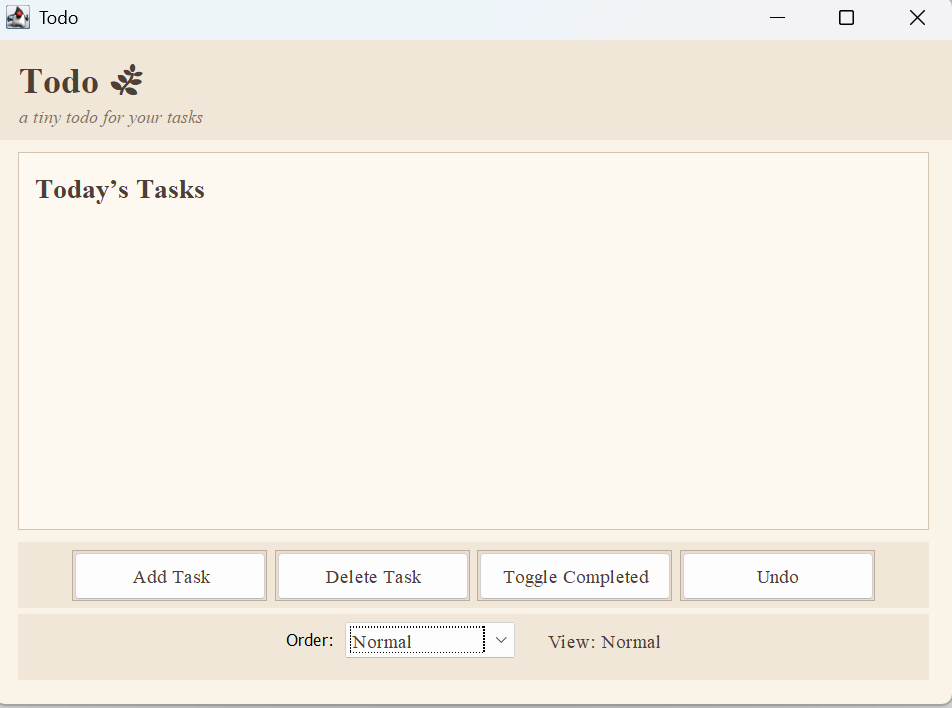
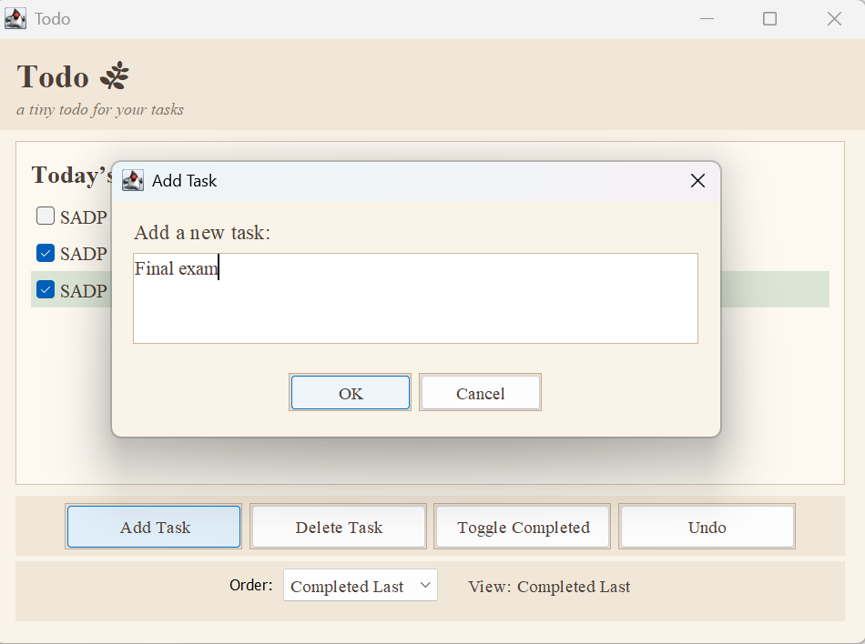
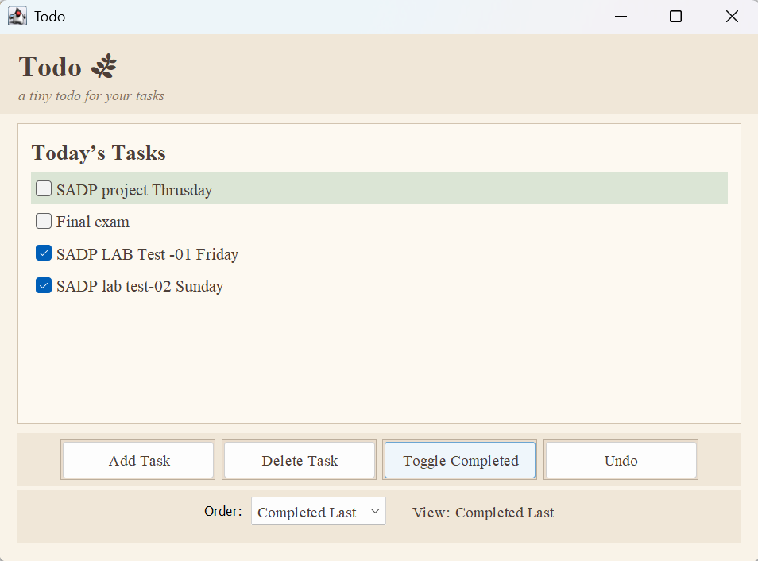

# 📘 Todo – A Basic Task Manager

*A lightweight Java Swing application demonstrating clean architecture and 10 classic design patterns.*

---

## 📝 Overview

**Todo** is a simple, elegant desktop application for managing daily tasks.
It is intentionally lightweight, intuitive, and beginner-friendly, while still showcasing advanced software-engineering techniques under the hood.

This project integrates **all 10 GoF (Gang of Four) design patterns**, making it a great learning resource as well as a practical productivity tool.

---

## ✨ Features

* ✔️ Add, delete, and mark tasks as complete
* ✔️ Undo & redo using a command history system
* ✔️ Switch between different task-ordering modes
* ✔️ Clean and warm UI built with Java Swing
* ✔️ Persistent, responsive interface
* ✔️ Fully object-oriented architecture

---

## 🧩 Design Patterns Used

This project demonstrates all **10 foundational GoF design patterns** in a realistic way:

| Pattern       | Where It’s Used                                        |
| ------------- | ------------------------------------------------------ |
| **Singleton** | `TaskManager`                                          |
| **Factory**   | `TaskFactory`                                          |
| **Observer**  | `TaskManager` ↔ `MainFrame`                            |
| **Adapter**   | `LegacyNoteAdapter`                                    |
| **Command**   | Add/Delete/Toggle actions with undo/redo               |
| **Memento**   | `TaskManagerMemento` for state snapshots               |
| **Strategy**  | Custom ordering strategies (`Normal`, `CompletedLast`) |
| **Facade**    | `TaskAppFacade` — simplified interface for UI          |
| **Iterator**  | `SimpleTaskIterator`                                   |
| **Composite** | `CategoryComposite` + `TaskLeaf`                       |


---

## 📸 Screenshots

### 🏠 Main Interface



### ➕ Add Task Dialog



### ✔️ Completed Tasks View



---

## 🚀 Running the Project

### **Requirements**

* Java **8+**
* Any IDE that supports Java (IntelliJ IDEA, Eclipse, NetBeans, VS Code)

### **Steps**

1. Clone the repository:

   ```sh
   git clone https://github.com/Anu213007/Todo.git
   ```
2. Open the project in your IDE.
3. Run the main file:

   ```
   src/com/todo/Todo.java
   ```
4. The application will launch instantly.

---

## 📂 Project Structure

```
src/
└── com/todo/
    ├── Todo.java                   # Main entry point
    ├── Task.java                   # Task interface
    ├── BasicTask.java              # Core task implementation
    ├── LegacyNoteAdapter.java      # Adapter pattern
    ├── TaskManager.java            # Singleton + Observer + Memento
    ├── TaskFactory.java            # Factory pattern
    ├── Command/                   # All Command classes
    ├── Iterator/                  # Iterator pattern
    ├── Composite/                 # Category/task composite
    ├── Strategy/                  # Ordering strategies
    ├── MainFrame.java              # UI layer (Swing)
    └── TaskCellRenderer.java       # Custom checkbox rendering
```

---

## 🎨 UI Highlights

* Soft, calming color palette
* Balanced spacing and typography
* Custom checkbox task renderer
* Comfortable “Add Task” dialog with multi-line input
* Smooth visual hierarchy and subtle accents

---

## 📜 License

This project is released under the **MIT License**.
You’re free to use it for learning, personal projects, or expand it however you like.


